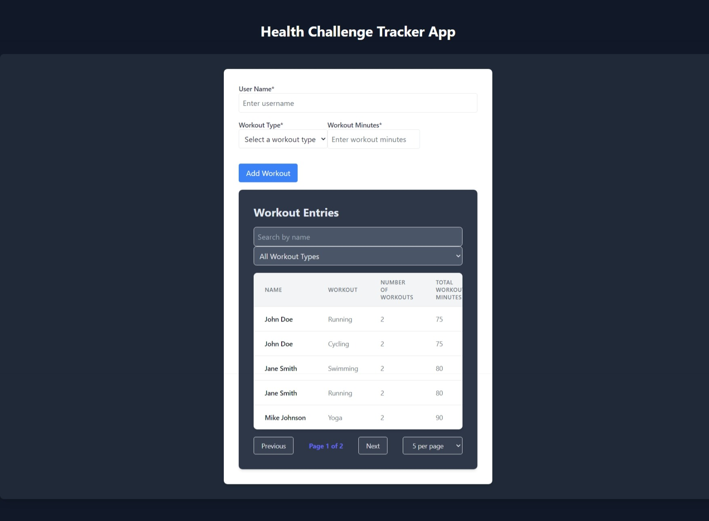
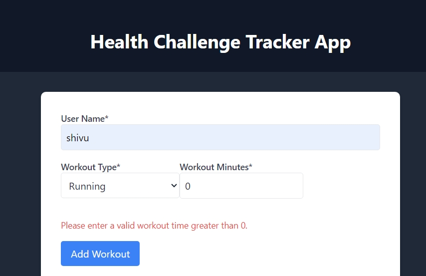
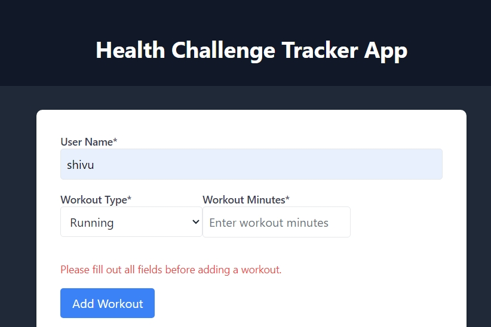
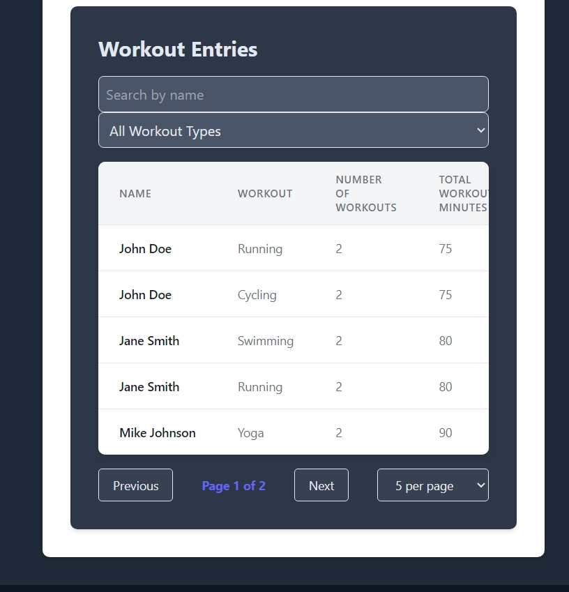
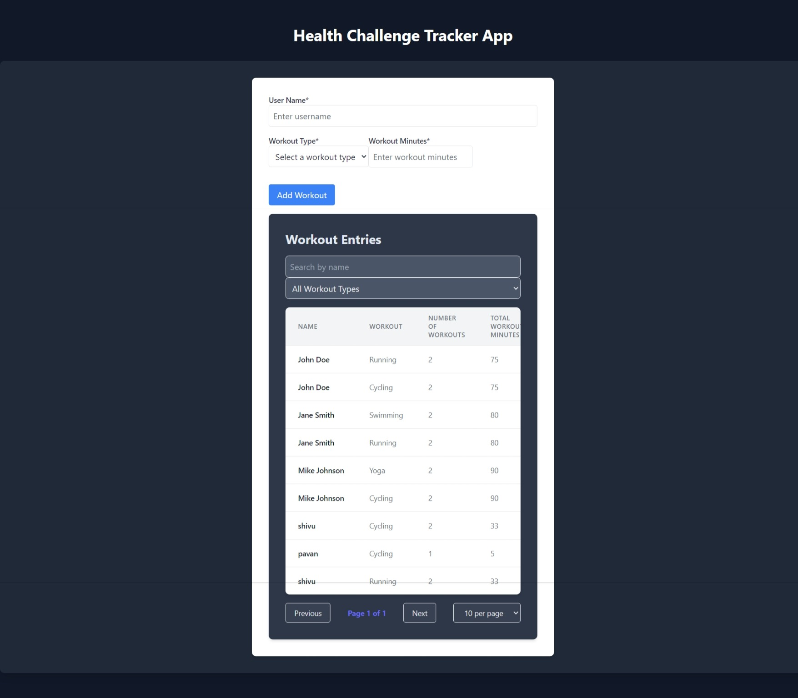

# Healthify

Healthify is a fitness tracking web application built with Angular CLI version 18.1.0. It allows users to manage their workout routines and track fitness progress conveniently.

## Screenshots

## Getting Started

### Prerequisites

Before running the application, ensure you have Node.js and npm installed on your machine.

### Installation

1. **Clone the repository**
git clone <repository-url>
cd healthify

2. **Install dependencies**
 npm install

### Development server

Run `ng serve` for a dev server. Navigate to `http://localhost:4200/`. The app will automatically reload if you change any of the source files.

### Build

Run `ng build` to build the project. The build artifacts will be stored in the `dist/` directory.

### Running unit tests

Run `ng test` to execute the unit tests via Karma.

### Running end-to-end tests

Run `ng e2e` to execute the end-to-end tests via a platform of your choice. Note: You need to first add a package that implements end-to-end testing capabilities.

### Additional Commands

You can use Angular CLI commands for code scaffolding:

- Generate a new component: `ng generate component component-name`
- Generate other Angular artifacts: `ng generate directive|pipe|service|class|guard|interface|enum|module`

## Usage

### User Manual

For detailed instructions on using Healthify, please refer to the [User Manual](./USER_MANUAL.md).

### Edge Cases Covered

- **Empty State Handling**: Proper messaging and guidance when no workouts are available or found.
- **Validation**: Ensuring all required fields are filled out correctly during workout addition and edit operations.
- **Error Handling**: Clear error messages and fallbacks when operations fail due to network issues or other reasons.
- **Pagination Limits**: Handling edge cases with pagination, such as navigating to non-existent pages.
- **Security**: Implementing secure authentication and authorization mechanisms to protect user data.

